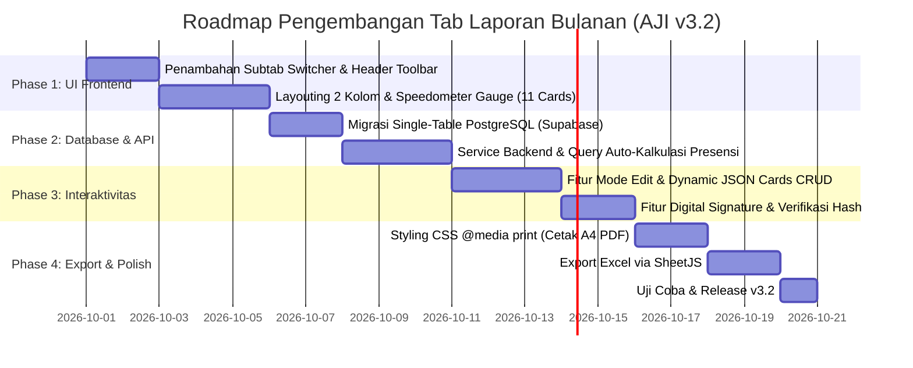

# Product Requirement Document (PRD)
## Fitur Tab "Laporan Bulanan" - Modul Rekapitulasi & Laporan
### Aplikasi Jatiwarna Info (AJI) v3.2

---

| Parameter | Keterangan |
| :--- | :--- |
| **Nama Fitur** | Tab "Laporan Bulanan" (*Monthly Activity & Governance Report Tab*) |
| **Modul Induk** | Rekapitulasi & Laporan (`#section-report`) |
| **Versi Target** | AJI v3.2 |
| **Status PRD** | Final / Disesuaikan Berdasarkan Masukan |
| **Target Pengguna** | Admin, Pengurus Desa, Operator Kelompok, Pengurus Kelompok |
| **Dokumen Referensi** | Tampilan "LAPORAN KEGIATAN BULANAN" (Desain UI Referensi) |

---

## 1. Pendahuluan & Latar Belakang

Saat ini, modul **Rekapitulasi & Laporan** di Aplikasi Jatiwarna Info (AJI) menyajikan data agregat demografi jamaah (kelompok peramutan, status ekonomi, gender) serta speedometer keaktifan kehadiran bulanan secara global. 

Namun, pengurus tingkat Kelompok dan Desa membutuhkan lembar laporan kerja bulanan yang komprehensif dan terstruktur (kegiatan musyawarah, persentase kehadiran pengajian per kelompok usia, laporan keuangan, kegiatan sosial/kemasyarakatan, catatan permasalahan, serta usul & saran). 

Penambahan tab **"Laporan Bulanan"** di dalam menu **Rekapitulasi & Laporan** bertujuan untuk mentransformasi proses laporan bulanan dari format kertas/manual menjadi sistem laporan digital interaktif yang dapat diisi, disetujui, ditandatangani secara digital, serta dicetak/diekspor secara instan ke format PDF dan Excel.

---

## 2. Tujuan & Sasaran (Objectives & Key Results)

### 2.1. Tujuan Utama
1. **Digitalisasi Laporan Bulanan Organisasi**: Menyediakan *dashboard/executive summary report* yang mencakup seluruh indikator efektivitas kegiatan kelompok/desa dalam 1 tampilan terintegrasi.
2. **Konektivitas Data Otomatis**: Mengintegrasikan metrik tingkat kehadiran pengajian dan statistik kegiatan secara otomatis dari database presensi AJI, mengurangi pengisian data manual.
3. **Pengesahan & Transparansi Digital**: Menyediakan fitur penyuntingan teratur (*Mode Edit*), catatan kendala/permasalahan, serta stempel digital (*Digital Signature Stamp*) untuk otentikasi pengesahan laporan.
4. **Fitur Ekspor Siap Cetak**: Menghasilkan output PDF yang rapi (format kertas standar A4) dan file Excel (`.xlsx`) untuk keperluan pengarsipan resmi yayasan/desa.

### 2.2. Indikator Keberhasilan (Key Results)
* 100% kelompok pengajian di Desa Jatiwarna dapat membuat dan mengirimkan Laporan Bulanan melalui aplikasi AJI.
* Efisiensi waktu penyusunan laporan bulanan dari rata-rata 2 hari manual menjadi kurang dari 15 menit.
* Kemudahan cetak PDF berpresisi tinggi tanpa terpotong (*responsive print layout*).

---

## 3. Arsitektur Navigasi & Struktur Tab

Di dalam halaman **Rekapitulasi & Laporan** (`#section-report`), akan ditambahkan sistem penjelajahan berbasis Tab Switcher (*Sub-tabs*):

```
===================================================================================
[ Modul: Rekapitulasi & Laporan ]
===================================================================================
|  [Tab 1] Rekapitulasi Umum   |  [Tab 2] Laporan Bulanan (BARU)                  |
===================================================================================
```

* **Tab 1: Rekapitulasi Umum** (Subtab existing): Berisi grafik demografi jamaah, sebaran kelompok peramutan, status ekonomi, dan ringkasan kehadiran.
* **Tab 2: Laporan Bulanan** (Subtab baru): Berisi dashboard lembar Laporan Kegiatan Bulanan lengkap sesuai desain referensi.

---

## 4. Spesifikasi UI/UX & Detail Komponen Halaman

Tampilan Laporan Bulanan mengadopsi tema *dark-emerald modern / clean light print hybrid layout* yang estetis, terstruktur, dan mudah dibaca.

```
+-----------------------------------------------------------------------------------+
|  HEADER & FILTER TOOLBAR                                                          |
|  - Judul & Subtitle Organisasi                                                     |
|  - Badges Status: Database Sync, Mode Edit Toggle, Terbit Date                    |
|  - Action Buttons: [ Unduh Excel ] [ Cetak / Ekspor PDF ]                         |
|  - Filter Bar: [ Kelompok (master_kelompok) ] [ Periode ] [ Tingkatan (Kelompok/Desa/Daerah) ] |
+-----------------------------------------------------------------------------------+
|  SECTION 1: INDIKATOR KEHADIRAN & EFEKTIVITAS (SPEEDOMETER GAUGES)               |
|  - Musyawarah: [ Musyawarah Kelompok ] [ Musyawarah PJP ] [ Musyawarah 5 Unsur ]  |
|  - Pengajian:  [ Pengajian Daerah ] [ Pengajian Desa ] [ Pengajian Kelompok ]      |
|                [ Pengajian Caberawit ] [ Pengajian GUS ] [ Pengajian GUM ]         |
|                [ Pengajian Ibu-Ibu ] [ Pembacaan Teks ]                            |
+-----------------------------------------------------------------------------------+
|  MAIN CONTENT LAYOUT (2 KOLOM: LEFT 65% / RIGHT 35%)                              |
|                                                                                   |
|  LEFT COLUMN:                                RIGHT COLUMN:                        |
|  +---------------------------------------+  +----------------------------------+  |
|  | 1. MUSYAWARAH (Table Agenda & % Hdr)  |  | LAPORAN TAMBAHAN                 |  |
|  +---------------------------------------+  | - Asrama Liburan GUS/Caberawit   |  |
|  | 2. SAMBUNG PENGAJIAN (Table & Rasio)  |  | - Implementasi Sistem AJI        |  |
|  +---------------------------------------+  | [ + Tambah Laporan Tambahan ]    |  |
|  | 3. KEUANGAN KELOMPOK (Status Audit)   |  +----------------------------------+  |
|  +---------------------------------------+  | PERMASALAHAN (Alert Card)        |  |
|  | 4. KEGIATAN LAINNYA (Pelaporan Lain)  |  | - Highlight Isu/Kendala Utama    |  |
|  +---------------------------------------+  | [ + Tambah Permasalahan ]        |  |
|                                             +----------------------------------+  |
|                                             | USUL & SARAN                     |  |
|                                             | - Poin Tindak Lanjut & Solusi    |  |
|                                             | [ + Tambah Usul & Saran ]        |  |
|                                             +----------------------------------+  |
|                                             | DIBUAT & DISAHKAN DI             |  |
|                                             | - Tanggal & Tempat Pengesahan    |  |
|                                             | - Digital Signature Stamp + QR   |  |
|                                             | - Nama & Jabatan PenanggungJawab |  |
|                                             +----------------------------------+  |
+-----------------------------------------------------------------------------------+
|  FOOTER: Identitas Yayasan/Desa & Link Navigasi Kembali ke Atas                   |
+-----------------------------------------------------------------------------------+
```

### 4.1. Header & Toolbar Kontrol
1. **Header Identitas Laporan**:
   - Title: `LAPORAN KEGIATAN BULANAN`
   - Subtitle: `Yayasan Assalam Barokah Jamiul Huda` / `Desa Jatiwarna`
   - Status Sync: Badge `Database: Terhubung (Sync Aktif)`
   - Mode Edit Switcher: Button Toggle `Mode Edit: Mati / Aktif` (Hanya untuk pengguna berwenang).
   - Timestamp Terbit: Badge tanggal cetak/terbit laporan.
2. **Tombol Aksi Utama**:
   - `Unduh Excel` (Icon Excel green): Mengekspor data laporan ke spreadsheet.
   - `Cetak / Ekspor PDF` (Icon PDF/Print): Memicu fungsi cetak browser dengan stylesheet print khusus.
3. **Filter Control Bar**:
   - `KELOMPOK`: Dropdown dinamis ditarik langsung dari tabel database `master_kelompok` (Chandra, Dewa, dll. / Semua Kelompok).
   - `PERIODE KEGIATAN`: Dropdown Bulan & Tahun (misal: Juni 2026).
   - `TINGKATAN MUSYAWARAH`: Dropdown opsi `Kelompok`, `Desa`, `Daerah`.
   - `TANGGAL MUSYAWARAH`: Input tanggal / teks tanggal musyawarah.

---

### 4.2. Bagian 1: Indikator Kehadiran & Efektivitas (Speedometer Gauges)
Menampilkan jajaran kartu Gauge visual berbasis Canvas/SVG untuk mengukur capaian target:
1. **Musyawarah Kelompok** (Speedometer Kehadiran Musyawarah Kelompok).
2. **Musyawarah PJP Kelompok** (Speedometer Kehadiran Musyawarah PJP).
3. **Musyawarah 5 Unsur** (Speedometer Kehadiran Musyawarah 5 Unsur - tanpa kata Desa).
4. **Pengajian Daerah** (Speedometer Kehadiran Pengajian Tingkat Daerah).
5. **Pengajian Desa** (Speedometer Kehadiran Pengajian Tingkat Desa).
6. **Pengajian Kelompok** (Speedometer Kehadiran Pengajian Tingkat Kelompok Umum).
7. **Pengajian Caberawit** (Speedometer Kehadiran Pengajian Caberawit).
8. **Pengajian GUS** (Speedometer Kehadiran Pengajian GUS - Generasi Usia Sekolah).
9. **Pengajian GUM** (Speedometer Kehadiran Pengajian GUM - Generasi Usia Mandiri).
10. **Pengajian Ibu-Ibu** (Speedometer Kehadiran Pengajian Ibu-Ibu).
11. **Pembacaan Teks** (Speedometer Kehadiran Pembacaan Teks / Pengajian Teks).

---

### 4.3. Bagian 2 (Kolom Kiri - Data Utama)

#### A. Tabel 1: MUSYAWARAH
* **Deskripsi**: Rekapitulasi pelaksanaan & kehadiran musyawarah pengurus kelompok (Header Badge: Jumlah Kegiatan).
* **Kolom Tabel**:
  1. `URAIAN KEGIATAN`: Nama agenda musyawarah (e.g., Musyawarah Kelompok, Musyawarah Khusus, Musyawarah PJP Kelompok, Musyawarah 5 Unsur).
  2. `STATUS`: Status kelancaran (`Lancar`, `Nir-Agenda`, `Lancar / Cukup`, `Perlu Evaluasi`).
  3. `% KEHADIRAN`: Angka persentase dan mini progress bar visual.
  4. `POINT PEMBAHASAN / KETERANGAN`: Ringkasan isu yang dibahas pada musyawarah.

#### B. Tabel 2: SAMBUNG PENGAJIAN
* **Deskripsi**: Tingkat kehadiran jamaah menurut tingkatan/kategori kelompok pengajian (Header Badge: Jumlah Pertemuan, Status Memuaskan).
* **Kolom Tabel**:
  1. `TINGKAT PENGAJIAN`: Kategori pengajian (Pengajian Kelompok Umum, Pengajian Ibu-Ibu, Pengajian GUM, Pengajian GUS, Pengajian Cabe Rawit).
  2. `STATUS`: Badge indikator (`Lancar`, `Kurang Lancar`, `Tertinggi`).
  3. `% KEHADIRAN`: Persentase kehadiran agregat.
  4. `VISUAL RASIO`: Bar chart horizontal proporsional (Hijau jika $\ge 75\%$, Merah jika $< 75\%$).
  5. `CATATAN EVALUASI (DAPAT DIEDIT)`: Field teks catatan tindak lanjut per kategori.

#### C. Kartu 3: KEUANGAN KELOMPOK
* **Deskripsi**: Ringkasan status pertanggungjawaban keuangan kelompok.
* **Item Rincian**:
  - Uraian 1: Pembukuan / Infaq Rutin (Status: `Lancar`)
  - Uraian 2: Pemeriksaan Keuangan (Status: `Lancar`)
* **Footer Status**: Pertanggungjawaban oleh Bendahara Desa (`✓ Bukti Fisik Klr`).

#### D. Kartu 4: KEGIATAN LAINNYA
* **Deskripsi**: Pelaporan kegiatan lain.
* **Item Rincian**:
  - Latihan ASAD (Status: `Lancar`)
  - Perawatan Dhuafa (Jumlah: `2 orang`)
  - Perawatan Jamaah Sakit (Jumlah: `3 orang` - Rincian: Pak Sungkono, Ibu Surtiyo)
* **Footer Status**: Program Relawan & Kepedulian (`Bantuan Tersalurkan`).

---

### 4.4. Bagian 3 (Kolom Kanan - Informasi Tambahan & Pengesahan)

#### A. Card 1: LAPORAN TAMBAHAN
* Tempat mencatat kegiatan khusus non-rutin (misal: Asrama Liburan GUS & Caberawit, Uji Coba Implementasi Sistem AJI v3.1).
* Dilengkapi tombol `+ Tambah Laporan Tambahan` untuk menambah item dinamik.

#### B. Card 2: PERMASALAHAN (Alert Highlight Card)
* Menyoroti masalah/kendala utama dalam periode berjalan (misal: Kehadiran pengajian kelompok umum & ibu-ibu di bawah target 75%).
* Badge Status: `Prioritas: Perlu Tindakan Segera`, `ID Masalah: PR-01`.
* Dilengkapi tombol `+ Tambah Catatan Permasalahan`.

#### C. Card 3: USUL & SARAN
* Daftar rekomendasi solusi dan tindak lanjut organisasi.
* Itemized list berpenomoran (misal: Sosialisasi presensi online, konseling & silaturahim jamaah).
* Dilengkapi tombol `+ Tambah Usul & Saran`.

#### D. Card 4: DIBUAT DAN DISAHKAN DI (Digital Signature Box)
* Informasi Lokasi & Tanggal Pengesahan: `Bekasi, 15 Juli 2026`.
* **Digital Signature Badge**: QR Code / Digital Stamp dengan ID Verifikasi unik (`DIGITALLY SIGNED Hash: AJI-2026-CH`).
* Nama & Jabatan Penanggung Jawab: **TRI WAHYU W** (Ketua / Pengurus Kelompok Chandra - Desa Jatiwarna).

---

## 5. Spesifikasi Fungsionalitas & Interaktivitas

### 5.1. Mode Edit Dinamis (Dynamic Inline Editing)
1. **Toggle Switch**: Pengguna dengan hak akses Operator / Pengurus / Admin dapat menekan tombol `Mode Edit: Aktif`.
2. **Editable Fields**:
   - Catatan Evaluasi pada tabel Sambung Pengajian.
   - Text pembahasan pada Musyawarah.
   - Tambah/Hapus item Laporan Tambahan, Permasalahan, dan Usul & Saran.
   - Mengubah nama dan jabatan penanggung jawab.
3. **Auto-Save / Simpan Manual**: Menyediakan tombol `Simpan ke Database` untuk mengamankan data ke Supabase / GAS.

### 5.2. Auto-Kalkulasi Kehadiran dari Database
* Persentase kehadiran pada tabel **Sambung Pengajian** dan **Speedometer Gauge** dihitung secara *real-time* dari tabel `presensi_kegiatan` berdasarkan rentang bulan & kelompok yang dipilih.
* Perhitungan Formula:
  $$\% \text{Kehadiran} = \left( \frac{\text{Total Hadir Fisik} + \text{Online}}{\text{Total Jamaah Terdaftar dalam Kategori}} \right) \times 100\%$$

### 5.3. Fitur Ekspor & Pencetakan
* **Ekspor PDF Siap Cetak (`window.print()`)**:
  - Menggunakan CSS Media Query `@media print`.
  - Otomatis menyembunyikan sidebar, navbar, tombol aksi, dan filter bar saat dicetak.
  - Memastikan seluruh komponen 2 kolom ter-layout secara proporsional dalam halaman A4 tanpa kepotong.
* **Unduh Excel (`.xlsx`)**:
  - Menggunakan library SheetJS (`xlsx.full.min.js`) yang sudah terpasang di proyek AJI.
  - Menghasilkan file `.xlsx` berstruktur rapi berisi seluruh tabel musyawarah, pengajian, keuangan, dan masalah.

---

## 6. Penyederhanaan Skema Database (Single-Table Schema)

Sesuai masukan untuk efisiensi dan kemudahan integrasi, seluruh data Laporan Bulanan (termasuk rincian Laporan Tambahan, Permasalahan, Usul & Saran, serta rincian evaluasi) disatukan ke dalam **1 Tabel Utama (`laporan_bulanan`)** menggunakan kolom berjenis **JSONB / TEXT (JSON Stringified)**.

Hal ini mempermudah proses `UPSERT` / simpan data hanya dengan 1 kali panggilan API (Supabase / GAS) tanpa perlu menangani *multiple table JOIN* maupun *foreign key cascading*.

```sql
-- TABEL TUNGGAL LAPORAN BULANAN (SINGLE-TABLE DESIGN)
CREATE TABLE laporan_bulanan (
    id UUID PRIMARY KEY DEFAULT gen_random_uuid(),
    
    -- Filter Parameter Utama
    kelompok TEXT NOT NULL REFERENCES master_kelompok(nama) ON UPDATE CASCADE,
    periode_bulan INT NOT NULL CHECK (periode_bulan BETWEEN 1 AND 12),
    periode_tahun INT NOT NULL,
    tingkatan_musyawarah TEXT NOT NULL DEFAULT 'Kelompok', -- 'Kelompok', 'Desa', atau 'Daerah'
    tanggal_musyawarah DATE NOT NULL,
    tanggal_terbit DATE DEFAULT CURRENT_DATE,
    
    -- Data Musyawarah & Evaluasi Pengajian (Disimpan sebagai JSON)
    musyawarah_data JSONB DEFAULT '[]'::jsonb,
    -- Format: [{"uraian": "Musyawarah Kelompok", "status": "Lancar", "kehadiran_pct": 75, "keterangan": "..."}]
    
    pengajian_evaluasi JSONB DEFAULT '[]'::jsonb,
    -- Format: [{"tingkat": "Pengajian Kelompok Umum", "status": "Kurang Lancar", "kehadiran_pct": 38, "catatan": "..."}]
    
    -- Status Keuangan & Kegiatan Lain
    status_keuangan_infaq TEXT DEFAULT 'Lancar',
    status_keuangan_pemeriksaan TEXT DEFAULT 'Lancar',
    keuangan_bendahara TEXT DEFAULT 'Bendahara Desa',
    kegiatan_lainnya JSONB DEFAULT '[]'::jsonb,
    -- Format: [{"nama": "Latihan ASAD", "status": "Lancar"}, {"nama": "Perawatan Dhuafa", "status": "2 orang"}]
    
    -- Dynamic Cards (Laporan Tambahan, Permasalahan, Usul & Saran) dalam 1 Tabel
    laporan_tambahan JSONB DEFAULT '[]'::jsonb,
    -- Format: [{"judul": "Asrama Liburan GUS", "badge": "ASLD", "deskripsi": "..."}]
    
    catatan_permasalahan JSONB DEFAULT '[]'::jsonb,
    -- Format: [{"kode_id": "PR-01", "prioritas": "Perlu Tindakan Segera", "deskripsi": "..."}]
    
    usul_saran JSONB DEFAULT '[]'::jsonb,
    -- Format: [{"urutan": 1, "isi_usulan": "..."}]
    
    -- Pengesahan & Digital Signature
    penanggung_jawab_nama TEXT NOT NULL,
    penanggung_jawab_jabatan TEXT NOT NULL,
    digital_signature_hash TEXT,
    
    created_by TEXT REFERENCES app_users(username),
    created_at TIMESTAMPTZ DEFAULT NOW(),
    updated_at TIMESTAMPTZ DEFAULT NOW(),
    
    -- Constraint Unik Per Kelompok & Periode
    CONSTRAINT unq_laporan_kelompok_periode UNIQUE(kelompok, periode_bulan, periode_tahun)
);
```

### Keunggulan Skema Single-Table:
1. **Atomisitas Transaksi**: Penyimpanan seluruh bagian laporan bulanan (Musyawarah, Evaluasi, Permasalahan, Usul Saran) dilakukan dalam 1 kali query `UPSERT`.
2. **Fleksibilitas Struktur Data**: Penambahan jenis laporan tambahan atau kategori masalah tidak memerlukan modifikasi skema tabel (tanpa perlu `ALTER TABLE`).
3. **Kompatibilitas Google Sheets (GAS Fallback)**: Memudahkan penyimpanan ke 1 sheet spreadsheet Google (baris per laporan dengan kolom berformat JSON string).

---

## 7. Matriks Hak Akses (Role-Based Access Control)

| Peran (Role) | Lihat Laporan | Mode Edit / Input | Simpan ke Database | Cetak PDF & Excel |
| :--- | :---: | :---: | :---: | :---: |
| **Admin** | ✅ Semua Kelompok | ✅ Ya | ✅ Ya | ✅ Ya |
| **Pengurus Desa** | ✅ Semua Kelompok | ✅ Ya | ✅ Ya | ✅ Ya |
| **Operator Kelompok** | ✅ Kelompok Sendiri | ✅ Ya | ✅ Ya | ✅ Ya |
| **Pengurus Kelompok** | ✅ Kelompok Sendiri | ✅ Ya | ✅ Ya | ✅ Ya |
| **Jamaah** | ✅ View Only (Terbit) | ❌ Tidak | ❌ Tidak | ✅ PDF Only |

---

## 8. Rencana Tahapan Implementasi (Implementation Roadmap)



### Tahapan Rinci:
1. **Tahap 1 (UI Frontend Layout & Sub-tab Switching)**:
   - Modifikasi `index.html` pada `#section-report` untuk menambahkan tab switcher (`Rekapitulasi Umum` vs `Laporan Bulanan`).
   - Populasikan dropdown `KELOMPOK` dari tabel `master_kelompok` dan dropdown `TINGKATAN MUSYAWARAH` (`Kelompok`, `Desa`, `Daerah`).
   - Menyiapkan 11 speedometer gauge cards (Musyawarah & Sambung Pengajian).
2. **Tahap 2 (Single-Table Database Migration & Data Binding)**:
   - Eksekusi DDL Supabase untuk tabel tunggal `laporan_bulanan`.
   - Penulisan query agregasi kehadiran otomatis dari data presensi kegiatan bulanan.
3. **Tahap 3 (Mode Edit Interaktif & Dynamic JSON CRUD)**:
   - Implementasi event handler untuk Edit Mode, Tambah Permasalahan, Tambah Usulan, dan Tambah Laporan Tambahan.
   - Generasi kode QR / Hash Digital Signature otomatis saat laporan disahkan.
4. **Tahap 4 (Exporting & Print Optimization)**:
   - Penyesuaian stylesheet `@media print` agar layout saat dicetak persis seperti format berkas resmi tanpa ada pergeseran elemen.
   - Integrasi handler ekspor spreadsheet Excel.

---

## 9. Kesimpulan & Langkah Selanjutnya

Dokumen PRD ini telah disesuaikan sepenuhnya berdasarkan seluruh masukan perbaikan:
1. Filter Kelompok mengambil data secara dinamis dari `master_kelompok`, Tingkat Musyawarah bernilai `Kelompok/Desa/Daerah`.
2. Jajaran speedometer gauge mencakup 11 indikator lengkap (Musyawarah & Pengajian Daerah s/d Teks, Musyawarah 5 Unsur).
3. Deskripsi Kartu 4 disesuaikan menjadi *"Pelaporan kegiatan lain"*.
4. Skema database disederhanakan secara efisien menjadi **1 Single Table** `laporan_bulanan` berbasis JSONB.

**Rekomendasi Tindak Lanjut**:
1. Menyetujui dokumen PRD yang telah diperbarui ini.
2. Menjalankan skrip DDL migrasi single-table di Supabase.
3. Memulai pembuatan modul frontend sub-tab di `index.html` dan `js/ui.js` / `js/dashboard.js`.
